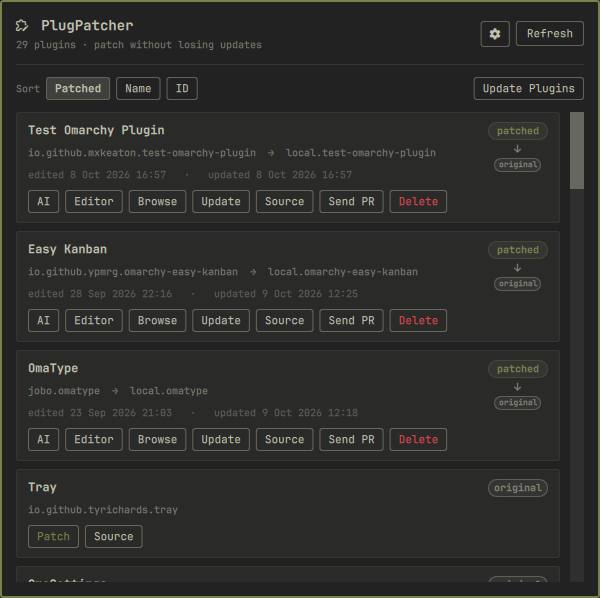
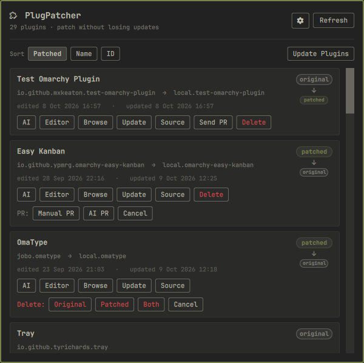

# PlugPatcher

Patch any Omarchy shell plugin and keep your changes in a git repo. Hit
**Patch** in the PlugPatcher panel, edit the code, and your version loads while
the original stays installed and keeps updating — merge upstream into your edits
anytime, and send them back as a pull request.

<p>
  
  
</p>

## Install

```bash
omarchy plugin add https://github.com/mxKeaton/plugpatcher --enable
```

Nothing else — the plugin ships the CLI it runs.

## Remove

Put your patched plugins back, then remove the widget and its data:

```bash
CLI=~/.config/omarchy/plugins/io.github.mxkeaton.plugpatcher/bin/plugpatcher
"$CLI" list                # what is being edited
"$CLI" revert <plugin-id>  # repeat for each

omarchy plugin remove io.github.mxkeaton.plugpatcher --yes
rm -rf ~/.local/share/plugpatcher ~/.local/state/plugpatcher ~/.config/plugpatcher
```

Everything lives in your home directory; `/usr/share/omarchy` is never touched.

## Use

Each plugin in the panel is a card:

- **Patch** — start editing a plugin.
- **AI** — open your coding agent in the code.
- **Editor** / **Browse** — open the code in your editor / file manager.
- **Update** — merge upstream changes into your version and rebuild it.
- **Source** — open the plugin's GitHub page.
- **Send PR** — **Manual PR** (GitHub's form) or **AI PR** (writes the text); **Cancel PR** withdraws it.
- **Delete** — remove the original, the patched copy, or both.
- **switch** — load patched ⇄ original (bar widgets restart the shell, ~3–4 s).

**Update Plugins** updates every installed plugin. `plugpatcher adopt <id>`
brings an existing plugin repo (with your commits) under PlugPatcher.

## Requirements

Omarchy (Quickshell) · `git`, `jq`, `python3` · `gh` (only for PRs) · `systemd`
(`systemd-run`)

## For AI agents

Copy `skills/plugpatcher/SKILL.md` into your agent's skills directory (e.g.
`~/.pi/agent/skills/plugpatcher/`) to teach it the workflow.

## License

MIT
